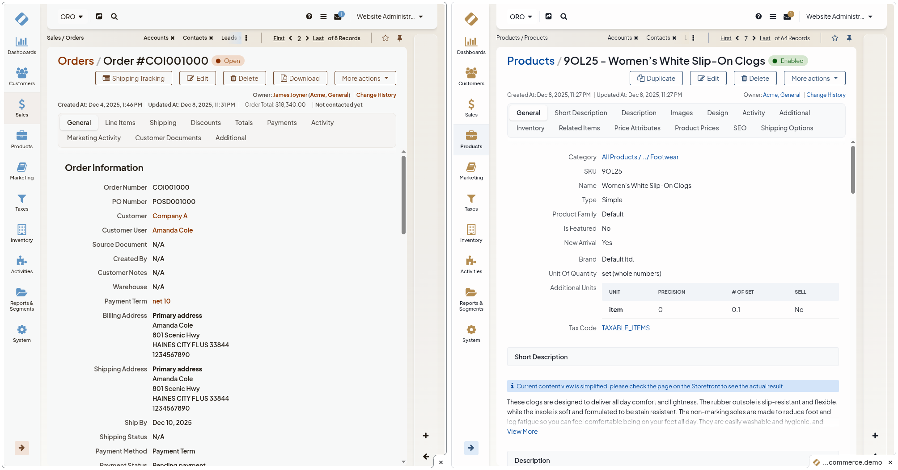

# Custom Body Class (Back-Office)

This example demonstrates how to add a custom CSS class to the `<body>` tag of a specific back-office page (the Order view page). It showcases three key customization techniques:

- Creating a JavaScript [page component](https://doc.oroinc.com/frontend/javascript/page-component/)
- [Overriding Twig templates](https://doc.oroinc.com/frontend/back-office/templates/)
- Registering custom CSS styles

## Why A Page Component?

OroCommerce back-office behaves like a typical single-page application: when you click around within the same browser tab, the browser does not reload the whole HTML document. Only the central content area is updated via AJAX, while the outer shell (including `<html>`, `<head>` and `<body>`) stays as it was after the very first load.

Customized back-office view templates (e.g., a report view, an order view) will only render into the main content area. Such templates would not re-render the `<body>` tag itself. So your customizations to those templates will only affect the initial full page load (hard refresh / open URL in new tab). Once the user starts navigating inside the back-office, the `<body>` element is never replaced, so any Twig changes to `<body>` on those views are simply not applied to the live DOM.

The proper way in Oro to dynamically modify those outer elements is to hook into the JavaScript page-component system. In this case, we can create a page component that will be initialized on the order view page and will add and remove CSS classes on `document.body` when a given page is active.

## How It Works

### 1. The JavaScript Page Component

The core functionality is implemented as a page component that extends `BaseComponent`. Page components are the recommended way to add JavaScript behavior to specific pages in Oro applications.

**File:** `assets/js/custom-body-class-component.js`

```javascript
import BaseComponent from 'oroui/js/app/components/base/component';

const CustomBodyClassComponent = BaseComponent.extend({
    classes: null,

    constructor: function CustomBodyClassComponent(options) {
        CustomBodyClassComponent.__super__.constructor.call(this, options);
    },

    initialize(options) {
        this.classes = options.bodyClass
            ? String(options.bodyClass).split(' ')
            : [];

        this.classes.forEach(cls => {
            if (cls) {
                document.body.classList.add(cls);
            }
        });

        CustomBodyClassComponent.__super__.initialize.call(this, options);
    },

    dispose() {
        if (this.disposed) {
            return;
        }

        this.classes.forEach(cls => {
            if (cls) {
                document.body.classList.remove(cls);
            }
        });

        CustomBodyClassComponent.__super__.dispose.call(this);
    }
});

export default CustomBodyClassComponent;
```

**Key points:**
- Uses ESM syntax (`import`/`export default`) for module loading
- Extends `BaseComponent` from `oroui/js/app/components/base/component`
- Declares a named `constructor` function, which is required for proper inheritance in Oro's Backbone-based component system
- The `initialize` method receives options passed from the template and adds the CSS class(es) to the body
- The `dispose` method removes the classes when the component is destroyed (e.g., when navigating to another page), ensuring proper cleanup

📚 [Page Component Documentation](https://doc.oroinc.com/frontend/javascript/page-component/)

### 2. Registering the JavaScript Module

To make the component available, register it in `jsmodules.yml`:

**File:** `config/oro/jsmodules.yml`

```yaml
dynamic-imports:
    commons:
        - js/custom-body-class-component
```

This registers the component under the `commons` group, making it available for dynamic loading across the application.

📚 [JS Modules Configuration](https://doc.oroinc.com/backend/configuration/yaml/jsmodules/)

### 3. Overriding the Template

To attach the page component to a specific page, override the original template:

**File:** `templates/bundles/OroOrderBundle/Order/view.html.twig`

```twig
{# Using ! is important to avoid infinite recursion as it tells Twig to use the original template, not the overridden one. #}



    {# Configure our page component for this page #}
    

    {{ parent() }}

```

**Key points:**
- The `@!OroOrder` syntax (with `!`) references the original template, preventing infinite recursion
- Setting the `pageComponent` variable automatically initializes the component when the block is rendered
- The `options` object is passed to the component's `initialize` method

📚 [Templates (Twig) Documentation](https://doc.oroinc.com/frontend/back-office/templates/)

### 4. Adding Custom Styles

Define CSS styles that target the custom body class:

**File:** `assets/css/scss/custom-body-class.scss`

```scss
body.custom-order-view-page {
    filter: hue-rotate(170deg) brightness(0.98);
    background-color: #99f6ff;
    font-weight: 600;
}
```

Register the stylesheet in `assets.yml`:

**File:** `config/oro/assets.yml`

```yaml
css:
    inputs:
        - 'assets/css/scss/custom-body-class.scss'
```


## File Structure

```
custom-body-class-6.1/
├── assets/
│   ├── css/
│   │   └── scss/
│   │       └── custom-body-class.scss      # Custom styles for the body class
│   └── js/
│       └── custom-body-class-component.js  # Page component
├── config/
│   └── oro/
│       ├── assets.yml                      # CSS registration
│       └── jsmodules.yml                   # JS module registration
└── templates/
    └── bundles/
        └── OroOrderBundle/
            └── Order/
                └── view.html.twig          # Template override
```

## Installation

Copy the contents of this example to your Oro application:

1. Copy `assets/` contents to your application's `assets/` directory.
2. Copy `config/oro/` files to your application's `config/oro/` directory. If `assets.yml` or `jsmodules.yml` already exist, merge the contents.
3. Copy `templates/bundles/` to your application's `templates/bundles/` directory.
4. Clear cache: `php bin/console cache:clear`
5. Rebuild assets: `php bin/console oro:assets:build`

## Screenshots

Unmodified back-office page on the right, order view page with custom body class on the left:


