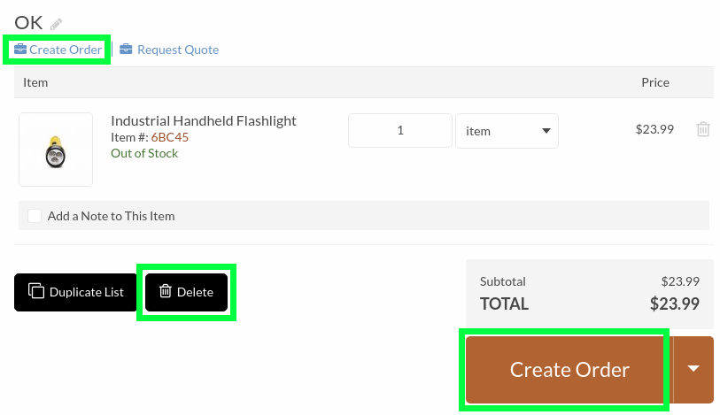
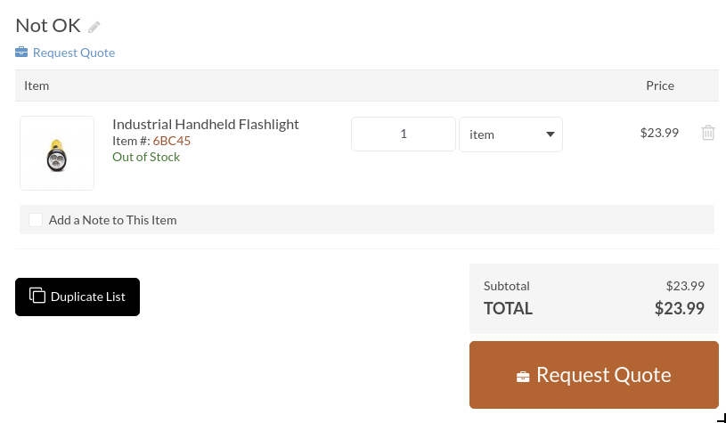

# DemoShoppingListButtonsBundle

This bundles contains an example of conditionally hiding "Delete" and "Create Order" buttons on the shopping list view page (storefront).

The condition in this example checks the shopping list label for the demonstration purposes. In real projects you may check other shopping list field or analyze the line item contents.
 
## Implementation

### "Create Order" Button

The "Create Order" button on the shopping list page is provided by the checkout workflow if the preconditions check of the workflow's start transition is successful.
 
In the default checkout workflow it is **start_from_shoppinglist** transition - [@OroCheckoutBundle/Resources/config/oro/workflows/includes/base_transition_definitions.yml#L71-L76](https://github.com/oroinc/orocommerce/blob/3.1.8/src/Oro/Bundle/CheckoutBundle/Resources/config/oro/workflows/includes/base_transition_definitions.yml#L71-L76)

As one of these preconditions is *@extendable*, we can create an event listener for *extendable_condition.shopping_list_start* event. If the event listener adds an error to the event, the *@extendable* precondition will produce *false*, the precondition check will fail (as logical *and* is used here), the *start_from_shoppinglist* transition will not be available and its button(s) will not be displayed:
* [event listener configuration](./Resources/config/services.yml#L2-L4)
* [event listener code](./EventListener/CheckoutShoppingListStartConditionListener.php)

Make sure to check class/variable types when retrieving any data deep from the context to prevent "method call on null" errors.

([more about workflows](https://github.com/oroinc/platform/blob/3.1.8/src/Oro/Bundle/WorkflowBundle/Resources/doc/reference/workflow/getting-started.md))

### "Delete" Button

The "Delete" button is provided by **oro_shoppinglist_delete** operation - [@OroShoppingListBundle/Resources/config/oro/actions.yml#L230-L250](https://github.com/oroinc/orocommerce/blob/3.1.8/src/Oro/Bundle/ShoppingListBundle/Resources/config/oro/actions.yml#L230-L250)

As there are no preconditions defined for this operation yet, we can define the operation with the same name in our custom bundle, and our preconditions [will be appended](https://github.com/oroinc/platform/blob/3.1.8/src/Oro/Component/Config/Resources/doc/configuration_merger.md#merge-configurations-with-the-same-name-from-two-bundles-use-append-strategy) to *oro_shoppinglist_delete* operation definition.

For this to work properly it is important to [set the correct priority for our custom bundle](./Resources/config/oro/bundles.yml#L2) so that it will be loaded [**after** OroShoppingListBundle](https://github.com/oroinc/orocommerce/blob/3.1.8/src/Oro/Bundle/ShoppingListBundle/Resources/config/oro/bundles.yml#L2).

([more about operations](https://github.com/oroinc/platform/blob/3.1.8/src/Oro/Bundle/ActionBundle/Resources/doc/operations.md))

## Result

The shopping list with "OK" label will have both "Create Order" and "Delete" buttons displayed:

Please note that "Create Order" in the default design theme is displayed on the shopping list page twice - as a link at the top of the page, and as one of the items in the drop-down button at the bottom.

Shopping lists with any other labels will not have "Delete" or either of "Create Order" buttons displayed:

